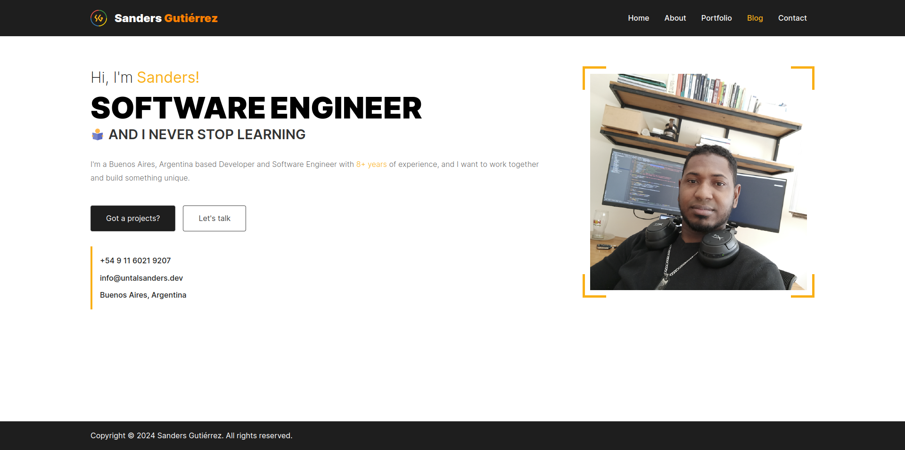

<div align="center">
    <h1> :rocket: Sanders Gutiérrez :rocket: </h1>
    <h3> :zap: Personal Website :zap:️ </h3>
</div>


<br>

## :checkered_flag: How to start

1. Install Node.js 20, go to [NVM](https://github.com/nvm-sh/nvm?tab=readme-ov-file#installing-and-updating) for install NVM
   ```shell
   nvm install 20 --lts
   ```

2. Set up as your default Node.js
   ```shell
   nvm alias default 20
   ```

3. Clone this repository:
   ```shell
   git clone https://github.com/untalsanders/untalsanders.github.io.git
   ```

4. Run development server
   ```shell
   npm run dev
   ```

Open [http://localhost:3000](http://localhost:3000) with your browser to see the result.

## :unlock: LICENSE

[MIT](LICENSE) © [Sanders Gutiérrez](https://untalsanders.github.io)
